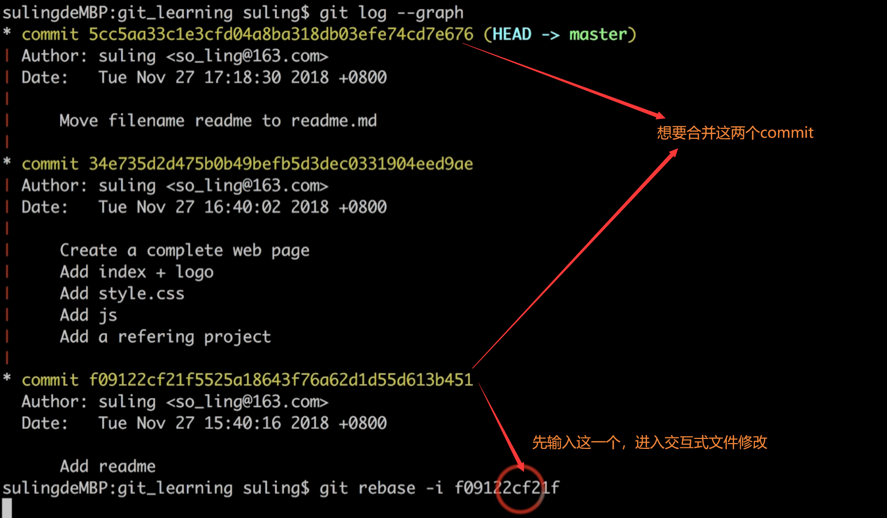

# 目录
[TOC]

## Git 命令

### git config

1. - `git config --list `  
展示所有的配置
   
   - `git config --list --local`  
展示计算机当前repository下的所有配置
   
   - `git config -Mark Text-list --global`  
展示计算机当前用户下的所有配置
   
   - `git config --list --system`  
展示计算机下的所有配置
   
   - `git config --global user.name`  
展示计算机当前用户下的某一配置，可以是其他的`--local`或`--system`

2. - `git config --local user.name 'username'`
`git config --local user.email 'email@email.com'`
修改某域下的某配置  

### git status

1. `git status`  
查看暂存区状态  

### git log

1. - `git log`  
查看版本演变史，及commit信息  
   
   - `git log -av --oneline -n2 --graph`
`-a`显示所有的commit，包括local和remote
`-v`显示详细信息
`--oneline`以一行的容量来显示简要信息，就是简略显示
`-n2`一共显示几条信息（几条commit）
`--graph`以终端图形化来显示

### git add

1. `git add filename`  
添加或更新文件到暂存区  

2. `git add -u`
更新所有已追踪（在暂存区）的文件

### git commit

1. `git commit -m 'message'`  
提交暂存区文件。如果还有未`git add`的文件，需要先提交到暂存区  

2. `git commit --amend`
修改最新一次commit的message

3. `git commit rebase -i commit_name`
交互式修改以前的commit
commit_name为需要修改的commit的最近邻上一次的commit
   

如图，想要rebase a7dc118和4292430，commit_name需要为22d7f8
之后会让你修改文件内容。

#### 修改连续的commit
   
##### 修改commit message
   

`pick`表示挑出来但不修改
`reword`表示接下来需要修改commit的message内容  
   
如下图，修改成期望的message内容：
   

保存提交就OK了
   
##### 合并连续的commit
   
合并四个commit为一个commit

   
如下图，修改成期望的message内容：

`squash`表示把commit合并到最oldest的commit，也就是文件最上面的commit(9c9891f)  
   
接下来修改message：

接下来保存提交就OK了
   
#### 修改不连续的commitd
   
##### 合并不连续的commit
   
如图，合并间隔的commit

   
接下来进入文件修改：
需要自己手动添加`pick f09122c`,可省略message

   
然后修改：
移动第四行的从commit到第二行，并修改为s，与f09112c(oldest)合并

   
**保存，会报错，输入`git rebase --continue`继续**
   

添加合并的commit的message
   
保存就OK了

### git mv

1. `git mv old_filename new_filename`  
更改工作目录和暂存区的文件名，相当于执行了三步：
`mv old_filename new_filename`
`git add new_filename`
`git rm --cached old_filename`  

### git rm

1. `git rm filename`  
删除工作目录和暂存区的文件，相当于执行了二步：
`rm filename`
`git rm --cached old_filename`  

2. `git rm --cached filename`
删除暂存区的文件

### gitk

1. `gitk --all`git自带的图形操作界面

### git branch

1. `git branch`or`git branch -av`
显示分支，`-v`：详尽的显示;`-a`：显示local和remot的

2. `git branch new_branch commit|old_branch`
从commit或branch新建分支

3. `git branch -d branch_name`or`git branch -D branch_name`
删除分支，如果`-d`报错，需要用`-D`强制删除

### git checkout

1. `git checkout commit|branch`
切换到commit或分支

2. `git checkout -b new_branch commit|old_branch`
从commit或branch新建分支new_branch，并切换过去

3. `git checkout -- filename1 filename2...`
使工作区恢复成暂存区一样。就是丢弃工作区指定文件使之和暂存区一样
暂存区--指定覆盖->工作区

### git diff

加上`-- filename1 filename1...`可以指定文件比较
例：`git diff --cached -- filename1 filename1`

1. `git diff`
   比较工作区和暂存区的区别

2. `git diff --cached`
比较暂存区和最新一次commit的区别

3. `git diff commit1 commit2`
比较两个commit的区别

4. `git diff branch1 branch2`
比较两个branch的区别，归根结底还是比较两个分支HEAD，也就是最新的那次commit的区别

### git reset

1. `git reset HEAD`
使暂存区恢复成HEAD一样。就是清空暂存区使之和HEAD一样
HEAD--覆盖->暂存区

2. `git reset HEAD -- filename1 filename1...`
使暂存区恢复成HEAD一样。就是丢弃暂存区指定文件使之和HEAD一样
HEAD--指定覆盖->暂存区

3. `git reset --hard commit`
使当前分支HEAD回退到分支中的某一commit，并丢弃之后（最新）的所有commit。暂存区和工作区也同步改变。
丢弃分支中的某些commit，回退到先前的commit

4. `git reset --hard HEAD`
使当前分支HEAD回退到分支中的HEAD，就是原地起跳的意思。产生的效果就是：暂存区和工作区都变为HEAD的内容。
可以理解为：从最新一次commit中恢复内容

### git stash

1. `git stash`
把当前工作区和暂存区的文件临时保存到一个地方，方便之后再切换回来。
比如工作区还有正在修改的文件，没有保存到暂存区。这时需要切换到另一个分支工作，可以先`git stash`，再切换到其他分支，完成后，再切换回来，恢复内容。

2. `git stash list`
列出所有的临时保存

3. `git stash apply`
把临时保存的工作区和暂存区内容恢复到当前分支上，并且临时保存的记录还在，可反复使用。使用`git stash list`仍可看到。

4. `git stash pop`
把临时保存的工作区和暂存区内容恢复到当前分支上，但是删除临时保存的内容。

### git cat-file

1. `git cat-file -t 散列值`
常看该散列值所属的类型

2. `git cat-file -p 散列值`
常看该散列值所属的内容

## git核心概念

**commit, tree, blob之间的关系**

以上三种都储存于 **.git/objects**中，两位文件夹名，加里面的文件名构成散列值。

### commit

每个commit都有唯一的散列值。
commit之中包含了各种属性，最重要的是包含了一棵树。可以认为一个commit就必定包含一棵树。

### tree

每棵树都有唯一的散列值。
一棵树可以理解为一个文件夹，里面包含其他tree和blob。

### blob

每个blob都有唯一的散列值。
一个blob可以理解为一个文件

### 数一数tree个数

- 一个commit下包含一个根节点tree（根文件夹），这个root tree下包含一个doc tree（doc文件夹），这个doc tree下包含一个blob。
- 故一个commit至少包含一颗root tree，再加上doc tree，共两颗tree

### 头指针(HEAD)

指的是当前指向哪一个commit。通常指向某个分支的最近一次提交。

### 分离头指针(detached HEAD)

指向的commit不属于任何分支。一般情况下，checkout到分支，但是分离头指针直接checkout到某一commit。
这种情况是危险的，因为之后checkout到其他分支时git会丢弃刚刚的commit。除非给他创建一个分支进行绑定。

## .git文件夹

### HEAD文件

表示当前指向哪一个分支
参考内容：`ref: refs/heads/master`

### COMMIT_EDITMSG文件

代表最新一次commit的信息，可以修改里面的message。执行命令`git commit --amend`就是修改此文件

### refs文件夹

一些引用信息
包含`heads`和`tags`文件夹

#### heads文件夹

表示存在哪些branch(分支)
里面的文件名就是branch名，文件内容为指向的branch的最新一次commit的散列值。

#### tags文件夹

表示存在哪些tag(标签)
里面的文件名就是tag名，文件内容为附上tag的commit的散列值

### objects文件夹

**包含三种内容：commit, tree, blob**

里面包含文件夹，文件夹里面包含文件，文件夹名加上文件名组成散列值，代表commit或tree或blob文件。

## git备份

### 备份到本地
`git clone file:///path/to/.git backup_repository.git`
把输入路径下面的git备份到当前路径，新repository名字为backup_repository。
**备份地址-clone from->源仓库**

### 提交到/path/to/.git
`git remote push_name file:///path/backup/backup_repository.git`
**源仓库-push to->备份仓库**
`git push --set-upstream push_name push_branch_name`
如果push_branch_name和当前分支一样，则可以不输